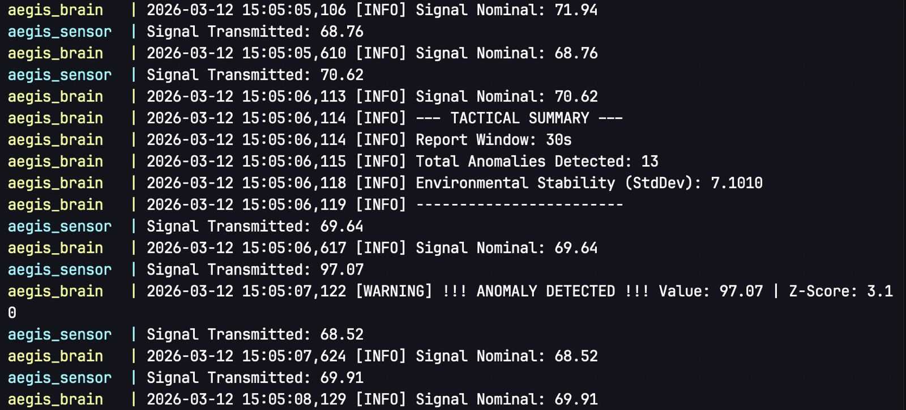

# Project Aegis: Signal Processing and Anomaly Detection

A distributed system designed for real-time telemetry monitoring. This project utilizes a containerized architecture to simulate a hardware-software interface, performing statistical analysis on high-frequency signal streams.

## System Architecture
The project is structured as a microservices environment using Docker and a dedicated bridge network:

- **Sensor Node:** Simulates raw hardware data. It generates a Gaussian signal with periodic, randomized tactical spikes to simulate environmental or mechanical anomalies.
- **Detection Engine:** A processing node that ingests UDP packets. It maintains a rolling data window to calculate real-time Z-scores, distinguishing significant deviations from standard background noise.
- **Infrastructure:** Built with Docker Compose for service orchestration, utilizing a private network (aegis_net) to isolate telemetry traffic.

## Methodology
### Dynamic Thresholding (Z-Score)
Rather than using static limits which fail in shifting environments, Project Aegis implements a dynamic Z-score calculation:

$$Z = \frac{|x - \mu|}{\sigma}$$

Where:
- $x$ is the current signal value.
- $\mu$ is the rolling mean of the last 50 data points.
- $\sigma$ is the rolling standard deviation.

A signal is flagged as an anomaly if $Z > 3.0$, representing a deviation outside 99.7% of the expected data range.

## Operational Logs and Reporting
The system generates a persistent audit trail. Every 30 seconds, the Detection Engine outputs a Tactical Summary, aggregating total detected anomalies and current environmental stability (Standard Deviation).

### Sample Execution Output:

